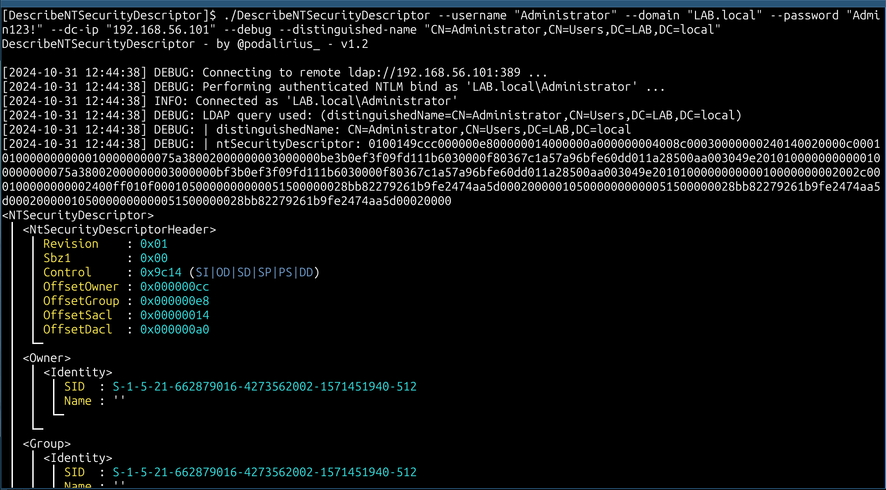
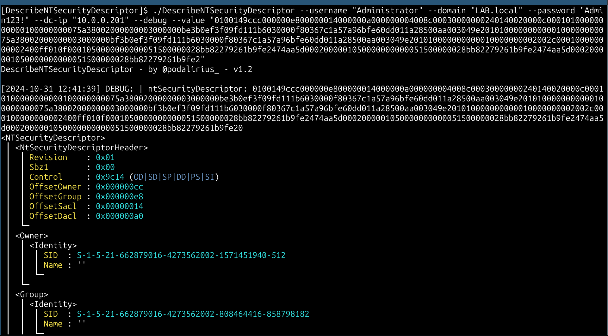

<p align="center">
      A cross-platforms tool to parse and describe the contents of a raw ntSecurityDescriptor structure. 
      <br>
      <a href="https://github.com/p0dalirius/DescribeNTSecurityDescriptor/actions/workflows/release.yaml" title="Build"></a>
      
      <a href="https://twitter.com/intent/follow?screen_name=podalirius_" title="Follow"></a>
      <a href="https://www.youtube.com/c/Podalirius_?sub_confirmation=1" title="Subscribe"></a>
      <br>
</p>

## Features

- [x] Reads source value from a file containing a raw ntSecurityDescriptor structure, in raw bytes, hex string or base64 string formats.
- [x] Reads source value from the LDAP.
- [ ] Outputs a human readable summary of accesses with `--summary`
- [x] Parsing of Access Control Entries (ACE) of various types:
  - [x] ACE type [`ACCESS_ALLOWED_ACE`](https://learn.microsoft.com/en-us/openspecs/windows_protocols/ms-dtyp/72e7c7ea-bc02-4c74-a619-818a16bf6adb?wt.mc_id=SEC-MVP-5005286)
  - [x] ACE type [`ACCESS_ALLOWED_OBJECT_ACE`](https://learn.microsoft.com/en-us/openspecs/windows_protocols/ms-dtyp/c79a383c-2b3f-4655-abe7-dcbb7ce0cfbe?wt.mc_id=SEC-MVP-5005286)
  - [x] ACE type [`ACCESS_DENIED_ACE`](https://learn.microsoft.com/en-us/openspecs/windows_protocols/ms-dtyp/b1e1321d-5816-4513-be67-b65d8ae52fe8?wt.mc_id=SEC-MVP-5005286)
  - [x] ACE type [`ACCESS_DENIED_OBJECT_ACE`](https://learn.microsoft.com/en-us/openspecs/windows_protocols/ms-dtyp/8720fcf3-865c-4557-97b1-0b3489a6c270?wt.mc_id=SEC-MVP-5005286)
  - [x] ACE type [`ACCESS_ALLOWED_CALLBACK_ACE`](https://learn.microsoft.com/en-us/openspecs/windows_protocols/ms-dtyp/c9579cf4-0f4a-44f1-9444-422dfb10557a?wt.mc_id=SEC-MVP-5005286)
  - [x] ACE type [`ACCESS_DENIED_CALLBACK_ACE`](https://learn.microsoft.com/en-us/openspecs/windows_protocols/ms-dtyp/35adad6b-fda5-4cc1-b1b5-9beda5b07d2e?wt.mc_id=SEC-MVP-5005286)
  - [x] ACE type [`ACCESS_ALLOWED_CALLBACK_OBJECT_ACE`](https://learn.microsoft.com/en-us/openspecs/windows_protocols/ms-dtyp/fe1838ea-ea34-4a5e-b40e-eb870f8322ae?wt.mc_id=SEC-MVP-5005286)
  - [x] ACE type [`ACCESS_DENIED_CALLBACK_OBJECT_ACE`](https://learn.microsoft.com/en-us/openspecs/windows_protocols/ms-dtyp/4652f211-82d5-4b90-bd58-43bf3b0fc48d?wt.mc_id=SEC-MVP-5005286)
  - [x] ACE type [`SYSTEM_AUDIT_ACE`](https://learn.microsoft.com/en-us/openspecs/windows_protocols/ms-dtyp/9431fd0f-5b9a-47f0-b3f0-3015e2d0d4f9?wt.mc_id=SEC-MVP-5005286)
  - [x] ACE type [`SYSTEM_AUDIT_OBJECT_ACE`](https://learn.microsoft.com/en-us/openspecs/windows_protocols/ms-dtyp/c8da72ae-6b54-4a05-85f4-e2594936d3d5?wt.mc_id=SEC-MVP-5005286)
  - [x] ACE type [`SYSTEM_AUDIT_CALLBACK_ACE`](https://learn.microsoft.com/en-us/openspecs/windows_protocols/ms-dtyp/bd6b6fd8-4bef-427e-9a43-b9b46457e934?wt.mc_id=SEC-MVP-5005286)
  - [x] ACE type [`SYSTEM_MANDATORY_LABEL_ACE`](https://learn.microsoft.com/en-us/openspecs/windows_protocols/ms-dtyp/25fa6565-6cb0-46ab-a30a-016b32c4939a?wt.mc_id=SEC-MVP-5005286)
  - [x] ACE type [`SYSTEM_AUDIT_CALLBACK_OBJECT_ACE`](https://learn.microsoft.com/en-us/openspecs/windows_protocols/ms-dtyp/949b02e7-f55d-4c26-969f-52a009597469?wt.mc_id=SEC-MVP-5005286)
  - [x] ACE type [`SYSTEM_RESOURCE_ATTRIBUTE_ACE`](https://learn.microsoft.com/en-us/openspecs/windows_protocols/ms-dtyp/352944c7-4fb6-4988-8036-0a25dcedc730?wt.mc_id=SEC-MVP-5005286)
  - [x] ACE type [`SYSTEM_SCOPED_POLICY_ID_ACE`](https://learn.microsoft.com/en-us/openspecs/windows_protocols/ms-dtyp/aa0c0f62-4b4c-44f0-9718-c266a6accd9f?wt.mc_id=SEC-MVP-5005286)
- [x] Parsing of SID
  - [x] Connect to LDAP to resolve sAMAccountNames of not well known SIDs
  - [x] Resolve names of well known SIDs
- [ ] Parsing of Access Control Lists (ACL):
  - [ ] Print if ACL is in [canonical form](https://learn.microsoft.com/en-us/openspecs/windows_protocols/ms-dtyp/20233ed8-a6c6-4097-aafa-dd545ed24428?wt.mc_id=SEC-MVP-5005286)
  

## Usage

```
$ ./DescribeNTSecurityDescriptor -h
DescribeNTSecurityDescriptor - by Remi GASCOU (Podalirius) - v1.2

Usage: DescribeNTSecurityDescriptor [--debug] [--domain <string>] [--username <string>] [--password <string>] [--hashes <string>] [--dc-ip <string>] [--port <tcp port>] [--use-ldaps] [--distinguished-name <string>] [--file-hex <string>] [--file-base64 <string>] [--file-raw <string>] [--value-hex <string>] [--value-base64 <string>]

  -d, --debug     Debug mode. (default: false)

  Authentication:
    -d, --domain <string>   Active Directory domain to authenticate to. (default: "")
    -u, --username <string> User to authenticate as. (default: "")
    -p, --password <string> Password to authenticate with. (default: "")
    -H, --hashes <string>   NT/LM hashes, format is LMhash:NThash. (default: "")

  LDAP Connection Settings:
    -dc, --dc-ip <string> IP Address of the domain controller or KDC (Key Distribution Center) for Kerberos. If omitted, it will use the domain part (FQDN) specified in the identity parameter. (default: "")
    -P, --port <tcp port> Port number to connect to LDAP server. (default: 389)
    -l, --use-ldaps       Use LDAPS instead of LDAP. (default: false)

  Source Values:
    -D, --distinguished-name <string> Distinguished Name. (default: "")
    -fh, --file-hex <string>          Path to file containing the hexadecimal string value of NTSecurityDescriptor. (default: "")
    -fb, --file-base64 <string>       Path to file containing the base64 encoded value of NTSecurityDescriptor. (default: "")
    -fr, --file-raw <string>          Path to file containing the raw binary value of NTSecurityDescriptor. (default: "")
    -vh, --value-hex <string>         Raw hexadecimal string value of NTSecurityDescriptor. (default: "")
    -vb, --value-base64 <string>      Raw base64 encoded value of NTSecurityDescriptor. (default: "")
```


## Demonstration with a `--distinguished-name`

```bash
./DescribeNTSecurityDescriptor --debug --username "Administrator" --domain "LAB.local" --password "Admin123!" --dc-ip "10.0.0.201" --distinguished-name "CN=Administrator,CN=Users,DC=LAB,DC=local"
```



## Demonstration with a `--value-hex`

```bash
./DescribeNTSecurityDescriptor --username "Administrator" --domain "LAB.local" --password "Admin123!" --dc-ip "10.0.0.201" --debug --value-hex "0100149ccc000000e800000014000000a000000004008c00030000000240140020000c00010100000000000100000000075a38002000000003000000be3b0ef3f09fd111b6030000f80367c1a57a96bfe60dd011a28500aa003049e2010100000000000100000000075a38002000000003000000bf3b0ef3f09fd111b6030000f80367c1a57a96bfe60dd011a28500aa003049e201010000000000010000000002002c000100000000002400ff010f0001050000000000051500000028bb82279261b9fe2474aa5d0002000001050000000000051500000028bb82279261b9fe2474aa5d0002000001050000000000051500000028bb82279261b9fe20"
```




## Building the project

To build the project, use the following Docker command in this directory:

```bash
docker run -v $(pwd):/workspace/ podalirius/build-go-project
```

Or, if you want to build it manually, you can use the following commands:

```
GOOS=linux GOARCH=amd64; mkdir -p "/workspace/bin/linux/${GOOS}/${GOARCH}/" && /usr/local/go/bin/go build -o "/workspace/bin/linux/${GOOS}/${GOARCH}/" -buildvcs=false
```


## Contributing

Pull requests are welcome. Feel free to open an issue if you want to add other features.
